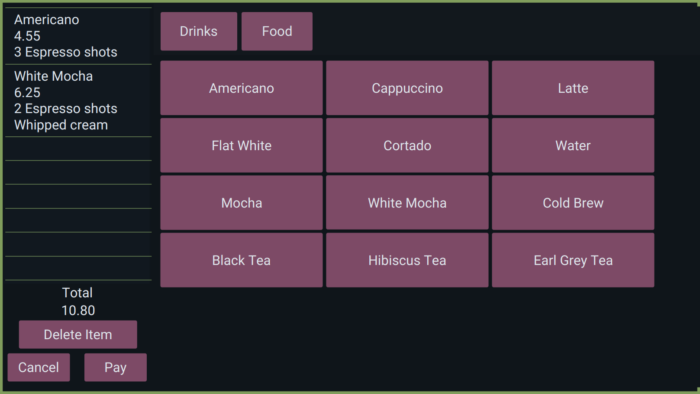
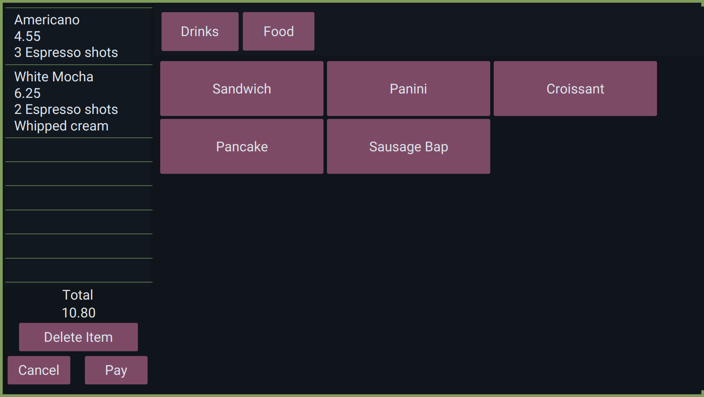
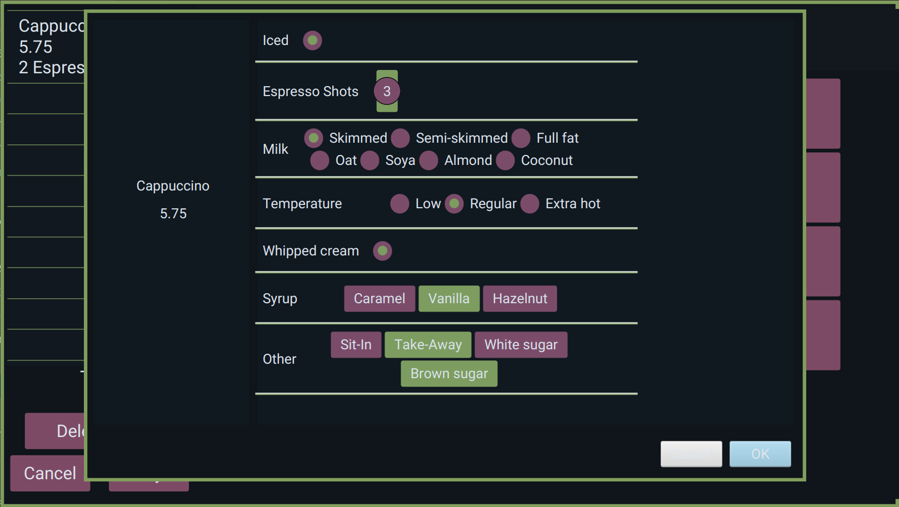
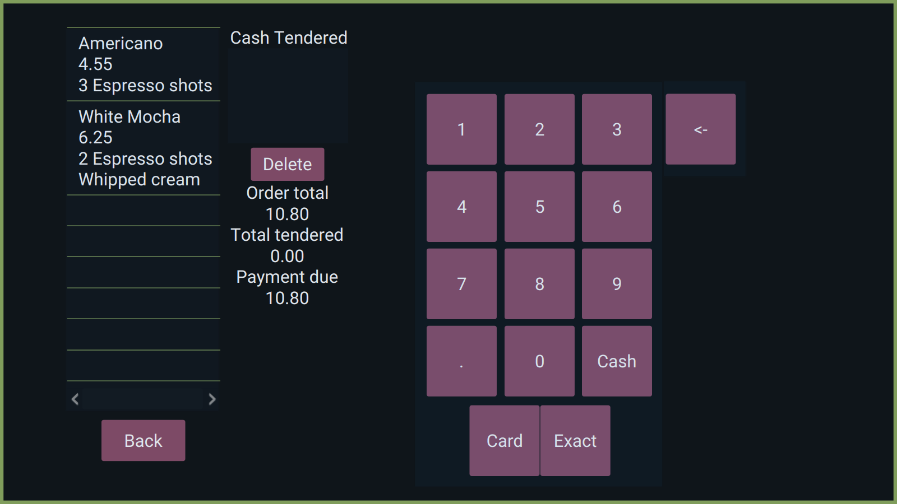
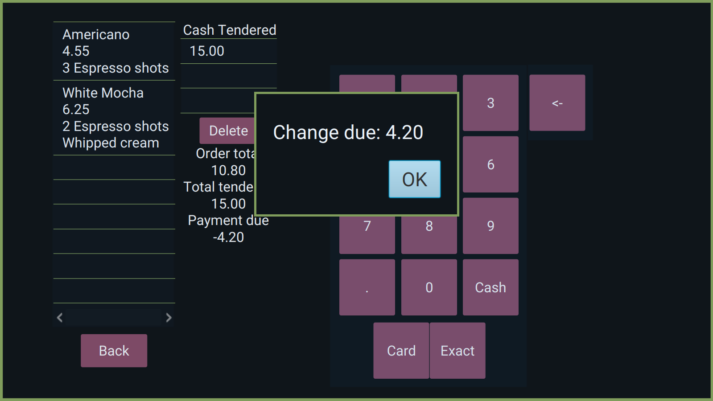

# MMFAD (MM..Food and Drink)

## Table of Contents

- Introduction
- Features
- Images
- Contributing
- License

## Introduction

MMFAD (MM..Food and Drink), is a Point of Sale (POS) system designed specifically for small cafes. 
MMFAD aims to simplify the daily operations of cafes and eateries by providing 
a user-friendly interface for managing orders, inventory, and customer interactions. 
Whether you're a small coffee shop or a quaint bistro, MMFAD is here to streamline your business processes.

## Features

- Interface: Simple to use interface with readable buttons and plain color palette.
- Customisation: Food/Drink items can be customised to add details.
- Payment: System keeps track of the cost of orders and how much payment is needed.

## Images

## Contributing

We welcome contributions from the open-source community to help improve MMFAD. 

## License

MMFAD is open-source software released under the MIT License. Feel free to use, modify, and distribute it according to the terms of this license.
